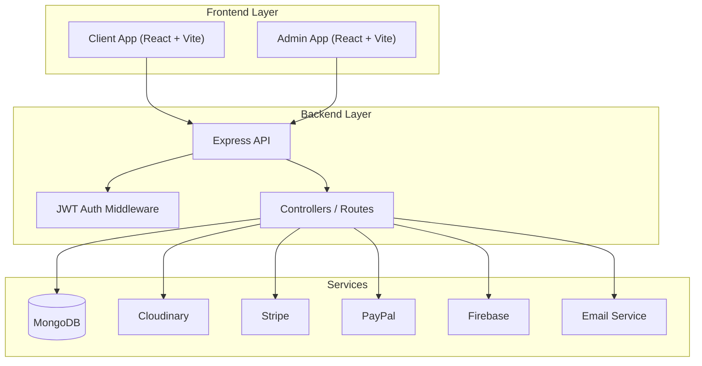

<p align="center">
  
  
  
  
  
</p>

<h1 align="center">
  <br>
  Web-Commere
  <br>
</h1>

<h4 align="center">Full-stack e-commerce platform with customer storefront, admin dashboard and backend API for product, order and content management.</h4>

<p align="center">
  <a href="#-introduction">Introduction</a> •
  <a href="#-project-purpose">Project Purpose</a> •
  <a href="#-features">Features</a> •
  <a href="#-architecture">Architecture</a> •
  <a href="#-demo">Demo</a> •
  <a href="#-quick-start">Quick Start</a> •
  <a href="#-environment-configuration">Environment</a> •
  <a href="#-project-structure">Project Structure</a> •
  <a href="#-technology-stack">Tech Stack</a> •
  <a href="#-contributing">Contributing</a> •
  <a href="#-license">License</a>
</p>

---

## 📖 Introduction

**Web-Commere** là dự án thương mại điện tử full-stack được xây dựng để mô phỏng một hệ thống bán hàng online hoàn chỉnh. Dự án tách thành 3 phần chính:

- **Client**: giao diện mua sắm cho người dùng
- **Admin**: trang quản trị sản phẩm, đơn hàng, banner, blog và người dùng
- **Server**: REST API xử lý xác thực, dữ liệu, upload ảnh và thanh toán

Hệ thống hỗ trợ các luồng quan trọng của một website bán hàng hiện đại như duyệt sản phẩm, tìm kiếm, lọc, giỏ hàng, địa chỉ giao hàng, thanh toán và quản trị nội dung.

| Thành phần | Mô tả |
|-----|-------|
| 🛍️ **Customer Storefront** | Giao diện mua sắm, xem sản phẩm, giỏ hàng, thanh toán, tài khoản cá nhân |
| 🧑‍💼 **Admin Dashboard** | Quản lý sản phẩm, danh mục, đơn hàng, người dùng, banner, home slider và blog |
| 🔐 **Authentication System** | Đăng ký, đăng nhập, xác thực email, quên mật khẩu, refresh token |
| 💳 **Checkout Flow** | Hỗ trợ Stripe, PayPal và COD với quy trình đặt hàng hoàn chỉnh |

### Tại sao dự án này hữu ích?

- **Tái hiện luồng e-commerce thực tế**: từ duyệt sản phẩm đến đặt hàng và quản lý đơn hàng
- **Tách biệt rõ client và admin**: dễ bảo trì, mở rộng và deploy
- **Backend bám sát domain bán hàng**: route, controller, model được chia theo nghiệp vụ
- **Phù hợp làm đồ án hoặc portfolio**: có cả frontend, backend, auth, upload ảnh và payment

---

## 🎯 Project Purpose

### Project này dùng để làm gì?

Project được dùng để xây dựng một nền tảng bán hàng online, nơi:

- Người dùng có thể đăng ký tài khoản, đăng nhập và mua sắm
- Người dùng có thể xem sản phẩm, thêm vào giỏ hàng, lưu wishlist và đặt hàng
- Quản trị viên có thể quản lý dữ liệu hệ thống từ dashboard riêng

### Giải quyết vấn đề gì?

Project giải quyết bài toán triển khai một hệ thống e-commerce có đầy đủ các module cốt lõi:

- Quản lý sản phẩm và danh mục tập trung
- Xử lý luồng mua hàng trực tuyến end-to-end
- Quản lý đơn hàng và trạng thái thanh toán
- Tạo hệ quản trị riêng cho admin thay vì chỉnh dữ liệu thủ công

---

## ✨ Features

### 🛍️ Customer Features

```text
┌─────────────────────────┬─────────────────────────┬─────────────────────────┐
│  STOREFRONT             │  SHOPPING FLOW          │  ACCOUNT AREA           │
├─────────────────────────┼─────────────────────────┼─────────────────────────┤
│  • Trang chủ            │  • Giỏ hàng             │  • Đăng ký / đăng nhập  │
│  • Danh sách sản phẩm   │  • Wishlist             │  • Xác thực email       │
│  • Tìm kiếm / lọc / sort│  • Địa chỉ giao hàng    │  • Quên mật khẩu        │
│  • Chi tiết sản phẩm    │  • Thanh toán           │  • Hồ sơ người dùng     │
│  • Đánh giá sản phẩm    │  • Theo dõi đơn hàng    │  • Đơn hàng của tôi     │
└─────────────────────────┴─────────────────────────┴─────────────────────────┘
```

### 🧑‍💼 Admin Features

- Dashboard thống kê sản phẩm, đơn hàng, doanh thu và người dùng
- Quản lý sản phẩm, tồn kho, giá, banner ảnh và thuộc tính mở rộng
- Quản lý category, sub-category và third-level category
- Quản lý home slider, banner và blog
- Quản lý người dùng và trạng thái đơn hàng

### 🔐 Authentication & Security

- JWT-based authentication
- Role field trong user model
- Password hashing với `bcryptjs`
- Middleware bảo vệ route bằng token
- `helmet`, `cors`, `cookie-parser`, `morgan`

### 💰 Payment & Order Management

- **Stripe** cho thanh toán online
- **PayPal** cho thanh toán online
- **COD** cho thanh toán khi nhận hàng
- Lưu lịch sử đơn hàng, trạng thái thanh toán và trạng thái xử lý đơn

### 🖼️ Media & Content

- Upload ảnh bằng `multer`
- Lưu trữ ảnh qua `Cloudinary`
- Quản lý banner, slider và bài viết blog

---

## 🏗️ Architecture

### System Overview



### Backend Modules

| Module | Purpose |
|-------|---------|
| `user` | đăng ký, đăng nhập, xác thực email, tài khoản người dùng |
| `product` | CRUD sản phẩm, upload ảnh, lọc, tìm kiếm, sort |
| `category` | quản lý danh mục sản phẩm |
| `cart` | giỏ hàng |
| `myList` | danh sách yêu thích |
| `address` | địa chỉ giao hàng |
| `order` | tạo đơn hàng, doanh thu, thống kê |
| `homeSlider` | slider trang chủ |
| `bannerV1` | banner marketing |
| `blog` | bài viết nội dung |
| `chat` | lịch sử chat session |

---

## 🌐 Demo

- **Client Demo**: `https://web-commere-ymt9.vercel.app`
- **Admin Demo**: `https://web-commere-admin.vercel.app`
- **API Base URL**: `https://web-commere.vercel.app`

---

## 🚀 Quick Start

### Prerequisites

Đảm bảo bạn đã cài đặt:

- **Node.js** >= 20 hoặc 22
- **npm**
- **MongoDB Atlas** hoặc MongoDB local
- **Git**

### Installation

```bash
# 1. Clone repository
git clone <your-repository-url>
cd Web-Commere

# 2. Install dependencies for client
cd client
npm install

# 3. Install dependencies for admin
cd ../admin
npm install

# 4. Install dependencies for server
cd ../server
npm install
```

### Run Development Servers

Mở 3 terminal riêng:

```bash
# Terminal 1
cd server
npm run dev
```

```bash
# Terminal 2
cd client
npm run dev
```

```bash
# Terminal 3
cd admin
npm run dev
```

### Verify Installation

Sau khi chạy:

| Service | URL | Description |
|---------|-----|-------------|
| Client | http://localhost:5173 | React storefront |
| Admin | http://localhost:5174 | Admin dashboard |
| Server | http://localhost:8000 | Express API |
| Health Check | http://localhost:8000/api/health | API status |

Lưu ý: cổng của `admin` có thể thay đổi tùy Vite nếu cổng mặc định đang bận.

---

## ⚙️ Environment Configuration

### Client Environment (`client/.env`)

```env
VITE_API_URL=http://localhost:8000
VITE_APP_STRIPE_ID=your_stripe_publishable_key
VITE_APP_PAYPAL_CLIENT_ID=your_paypal_client_id
```

### Admin Environment (`admin/.env`)

```env
VITE_API_URL=http://localhost:8000
```

### Server Environment (`server/.env`)

```env
PORT=8000
MONGODB_URI=your_mongodb_connection_string

SECRET_KEY_ACCESS_TOKEN=your_access_token_secret
SECRET_KEY_REFRESH_TOKEN=your_refresh_token_secret

STRIPE_SECRET=your_stripe_secret
STRIPE_PUBLISHABLE_KEY=your_stripe_publishable_key

PAYPAL_MODE=sandbox
PAYPAL_CLIENT_ID_TEST=your_paypal_client_id
PAYPAL_SECRET_TEST=your_paypal_secret

cloudinary_Config_Cloud_Name=your_cloudinary_cloud_name
cloudinary_Config_api_key=your_cloudinary_api_key
cloudinary_Config_api_secret=your_cloudinary_api_secret
```

Ngoài ra, dự án còn có thể cần thêm biến môi trường cho:

- Firebase
- dịch vụ email
- Vercel deployment

---

## 📁 Project Structure

```text
Web-Commere/
├── client/                    # Frontend cho người dùng
│   ├── public/
│   ├── src/
│   │   ├── componets/
│   │   ├── Page/
│   │   ├── utils/
│   │   ├── App.jsx
│   │   └── main.jsx
│   └── package.json
├── admin/                     # Frontend quản trị
│   ├── public/
│   ├── src/
│   │   ├── Components/
│   │   ├── Pages/
│   │   ├── utils/
│   │   ├── App.jsx
│   │   └── main.jsx
│   └── package.json
├── server/                    # Backend API
│   ├── config/
│   ├── controllers/
│   ├── middleware/
│   ├── models/
│   ├── route/
│   ├── utils/
│   ├── index.js
│   └── package.json
└── README.md
```

---

## 🧰 Technology Stack

| Layer | Technology | Purpose |
|-------|------------|---------|
| **Frontend** | React 19, Vite | UI và bundler |
| | React Router | Routing |
| | Tailwind CSS | Styling |
| | Material UI | UI components |
| | Axios | API calls |
| **Backend** | Node.js, Express 5 | API server |
| | MongoDB, Mongoose | Database |
| | JWT, bcryptjs | Authentication |
| | Multer, Cloudinary | Upload và media |
| **Payments** | Stripe, PayPal | Online checkout |
| **Other Services** | Firebase, Nodemailer, Resend | Auth / email / integrations |

---

## 🔧 Available Scripts

### Client

```bash
cd client

npm run dev
npm run build
npm run lint
npm run preview
```

### Admin

```bash
cd admin

npm run dev
npm run build
npm run lint
npm run preview
```

### Server

```bash
cd server

npm run dev
npm start
```

---

## 🤝 Contributing

Nếu bạn muốn đóng góp cho project:

```bash
# 1. Fork repository

# 2. Clone fork của bạn
git clone <your-fork-url>

# 3. Tạo branch mới
git checkout -b feature/your-feature-name

# 4. Commit thay đổi
git commit -m "feat: add your feature"

# 5. Push branch
git push origin feature/your-feature-name

# 6. Tạo Pull Request
```

### Gợi ý convention

- `feat`: thêm tính năng mới
- `fix`: sửa lỗi
- `docs`: cập nhật tài liệu
- `refactor`: cải tổ code
- `style`: chỉnh format / UI nhỏ
- `chore`: việc bảo trì

---

## 📄 License

Hiện tại project **chưa có file `LICENSE` chính thức** trong repo.

Nếu bạn muốn public project chuyên nghiệp hơn, có thể thêm:

- **MIT License**
- hoặc license phù hợp với mục đích sử dụng của bạn

---

## 🙏 Acknowledgements

- [React](https://react.dev/)
- [Vite](https://vitejs.dev/)
- [Express](https://expressjs.com/)
- [MongoDB](https://www.mongodb.com/)
- [Cloudinary](https://cloudinary.com/)
- [Stripe](https://stripe.com/)
- [PayPal](https://www.paypal.com/)
- [Material UI](https://mui.com/)

---

<p align="center">
  Made for Web-Commere
</p>

<p align="center">
  <a href="#-introduction">Back to Top ↑</a>
</p>
